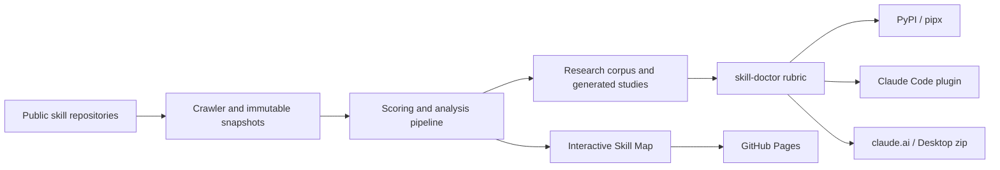

# The Skill Map

**A living reference for the Agent Skills ecosystem: 4,975 skills across 43
repositories, 13 domains, and five uncharted territories.**

The Skill Map combines an interactive ecosystem map with a crawled research
corpus. It shows what skill authors are building, how practices spread between
repositories, and where important categories remain absent.

[**Explore the live map →**](https://dhk.github.io/skill-map/)

## Start here

This repository contains two related products:

| If you want to… | Start with |
|---|---|
| Explore the published Agent Skills ecosystem | [Open the map](https://dhk.github.io/skill-map/) |
| Review and improve one `SKILL.md` | [Install skill-doctor](SKILL-DOCTOR.md) |
| Understand the evidence and methodology | [Read the research index](docs/README.md) |
| Submit a public skills repository | [Follow the contribution guide](CONTRIBUTING.md#submit-your-skills-repo) |
| Develop the crawler, scorer, or site | [Set up a development checkout](CONTRIBUTING.md#develop-this-repo) |

The map is a browser-based research artifact; it requires no installation.
skill-doctor is the installable tool derived from the same evidence base.

## Why it matters

Published skills cover the task layer well: writing Terraform, reviewing
contracts, generating dbt models, and thousands of other bounded jobs. The
corpus also makes the missing infrastructure visible.

Five territories had no published skills in the June 2026 crawl:

1. **The session layer** — continuity, planning, context handoff, and reset
   practices across working sessions.
2. **AI as a personal operating system** — coordinated workflows that make an
   assistant persistent rather than stateless.
3. **Skill discovery** — canonical registries, versioning, and dependency
   management.
4. **Skill evaluation** — shared benchmarks and evidence that a skill improves
   its intended outcome.
5. **Healthcare and life sciences** — clinical workflows, regulated data, and
   domain-specific safety.

The absence is useful evidence. It shows where the ecosystem has mature task
coverage and where it still lacks shared infrastructure.

## Architecture

The repository keeps the public research artifact and its derived authoring
tool together while distributing them independently.



- **Skill Map** uses the crawl and derived JSON to publish an interactive view
  of the ecosystem.
- **skill-doctor** turns corpus-measured practices into an interactive review
  for one skill.
- **CI guards** check corpus integrity and prevent headline figures in the
  documentation from drifting silently.

See [the architecture overview](docs/architecture/overview.md) for the system
context, containers, and design boundaries.

## Use the map

The [live map](https://dhk.github.io/skill-map/) supports several views into the
ecosystem:

- select a domain to focus the graph;
- select an organization to see its published skills;
- select a skill to inspect its domain and source;
- use **DHK** to isolate the session-layer cluster;
- use **Uncharted** to expose the five missing territories.

The interactive graph is a curated view of 1,119 skills from 52 organizations.
The broader research corpus contains the full contents of 4,975 Claude-format
skills across 43 repositories, plus 418 Gemini-format files catalogued by
metadata. These layers serve different purposes and their counts should not be
treated as interchangeable.

## Review a skill with skill-doctor

The shortest published installation is:

```bash
pipx run dhk-skill-doctor
```

Then invoke `/skill-doctor` in Claude Code.

Other supported routes include a reviewed `curl` installer, the Claude Code
plugin marketplace, and a zip upload for claude.ai or Claude Desktop. See
[skill-doctor](SKILL-DOCTOR.md) for the product overview and [the detailed
installation guide](INSTALL.md) for verification, version pinning, manual
installation, and troubleshooting.

## Research outputs

The repository publishes evidence at three levels:

- **Generated snapshots** — current counts, conventions, originators, wiring,
  and curiosities rebuilt from crawl data.
- **Reference material** — the empirical rubric, author checklist, and
  repository-signature recommendations.
- **Narrative studies** — ecosystem vulnerabilities, skill types, evaluation
  findings, and the implications of the negative space.

[The research index](docs/README.md) separates generated material from
hand-written analysis and planning documents.

## Data and reproducibility

- **Crawler:** [`crawlers/crawl.py`](crawlers/crawl.py) performs repo-scoped
  Git tree walks with incremental SHA tracking.
- **Seed lists:** [`crawlers/crawl-lists/`](crawlers/crawl-lists/) records the
  repositories included in a crawl.
- **Immutable snapshots:** [`crawls/`](crawls/) preserves individual crawl
  outputs.
- **Derived data:** [`data/`](data/) is regenerated from those snapshots.
- **Pipeline:** [`crawlers/run_pipeline.py`](crawlers/run_pipeline.py)
  rebuilds scores, studies, and site data.
- **Current documented crawl:** June 2026.

Derived artifacts should be regenerated, not hand-edited. See
[CONTRIBUTING.md](CONTRIBUTING.md) for the supported validation path.

## Status

The map and corpus are published and usable. skill-doctor is distributed as
version 1.0.1. The repository is active and the data is point-in-time: displayed
counts describe the documented crawl rather than a live index of every public
skill.

## License and contributing

The project is available under the [MIT License](LICENSE).

To submit a repository, audit skills, or work on the crawler and map, see
[CONTRIBUTING.md](CONTRIBUTING.md).

## About

Built by [DHK](https://www.dhk.io), working on data, AI, and systems that make
their own evidence visible.

- [DHK website](https://www.dhk.io)
- [GitHub](https://github.com/dhk)
