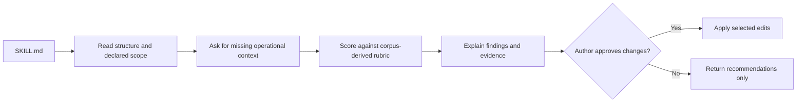

# skill-doctor

**An interactive, evidence-based reviewer for a single Claude Agent Skill.**

Give skill-doctor a `SKILL.md`. It asks about the context the file cannot reveal
on its own—tool scope, sensitive data, consequential actions, triggering, and
installation scope—then recommends changes and applies only those you approve.

The rubric comes from the [Skill Map](README.md) study of approximately 5,000
crawled skills. Corpus findings such as unscoped Bash access and missing
anti-triggers are converted into checks an author can act on.

## Install

### Published package

```bash
pipx run dhk-skill-doctor
```

This downloads the published `dhk-skill-doctor` wheel, installs the bundled
skill at `~/.claude/skills/skill-doctor`, and leaves no repository checkout or
persistent virtual environment. Then invoke `/skill-doctor` in Claude Code.

Re-run the command to update. Add `--force` to replace a locally edited copy.

### Shell installer

Review [`install.sh`](install.sh), then run:

```bash
curl -fsSL https://raw.githubusercontent.com/dhk/skill-map/main/install.sh | bash
```

This route clones the repository and symlinks the skill into
`~/.claude/skills`. Use it when you want an inspectable checkout that updates
with `git pull`.

### Careful step-by-step installation

[INSTALL.md](INSTALL.md) covers:

- verifying the source before execution;
- Claude Code marketplace installation;
- claude.ai and Claude Desktop zip upload;
- fully manual installation;
- version pinning and removal; and
- troubleshooting.

The detailed guide is the source of truth for installation variants. Commands
are not repeated here.

## What it checks

| Axis | Weight | Key checks |
|---|---:|---|
| Frontmatter | 20% | `name`, `description`, `license`, and an anti-trigger |
| Triggering | 25% | Positive trigger and explicit “do not use” boundary |
| Progressive disclosure | 15% | Workflow in `SKILL.md`; detail deferred to references |
| Structure | 15% | Clear use cases, exclusions, and numbered workflow |
| Safety | 25% | Tool scope, sensitive data, and confirmation before consequential actions |

The most common corpus gap is a missing anti-trigger. The second is an unscoped
`Bash` grant. skill-doctor treats both as practical design defects rather than
style preferences.

## How it works



The interview is necessary because important constraints—such as whether a tool
touches production data or performs an irreversible action—cannot be inferred
safely from prose alone.

## Runtime and privacy

The installed skill is self-contained Markdown. It requires no Python package or
network access at runtime. The PyPI package exists only to place that Markdown
on disk without requiring Git.

The review runs in the AI surface where you invoke it. Treat any uploaded
`SKILL.md` and answers about sensitive workflows according to that surface’s
data-handling policy.

## Update and remove

For the `pipx run` route:

```bash
pipx run dhk-skill-doctor --force
rm -rf ~/.claude/skills/skill-doctor
```

Marketplace and manual-install update paths are documented in
[INSTALL.md](INSTALL.md).

## Repository layout

```text
plugins/skill-doctor/
├── .claude-plugin/plugin.json
├── pyproject.toml
├── src/skill_doctor_installer/
└── skills/skill-doctor/
    ├── SKILL.md
    ├── WIRING.md
    └── reference/
        ├── rubric.md
        └── interview-bank.md
```

The skill tree is the single source of truth. The installer bundles that same
tree as package data.

## Status

Version 1.0.1 is distributed through PyPI, the Claude Code plugin marketplace,
and a zip for claude.ai or Claude Desktop. Release tags trigger PyPI Trusted
Publishing through
[`.github/workflows/publish-skill-doctor.yml`](.github/workflows/publish-skill-doctor.yml).

## Authorship

skill-doctor is built by [DHK](https://www.dhk.io). The repository path,
package metadata, plugin manifest, release tags, and Git history provide the
authorship and version trail.
