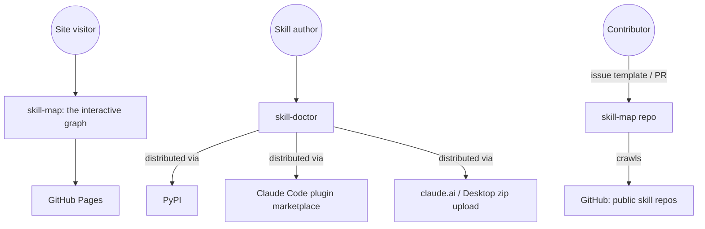
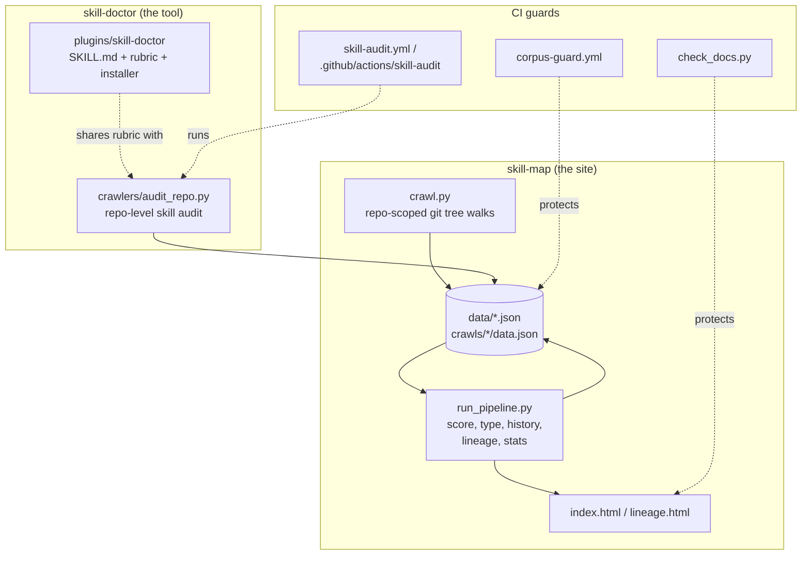

# Architecture

C4-style context and container views. Component- and code-level diagrams are
deliberately omitted — the crawler/pipeline scripts change too fast for a
diagram at that grain to stay accurate; `crawlers/run_pipeline.py`'s own
docstring is the authoritative stage list.

## System context

Two products live in this one repo, aimed at two different audiences:

- **skill-map**: a site (`index.html`, `lineage.html`) for anyone browsing the
  published Agent Skills ecosystem.
- **skill-doctor** (+ **skill-audit**): a tool ensemble (see
  [`WIRING.md`](../../WIRING.md)) for a skill author reviewing their own
  skill or repo — distributed independently of the crawler/site via PyPI, the
  Claude Code plugin marketplace, and a claude.ai/Desktop zip.

## Containers

- **Crawl pipeline**: `crawlers/crawl.py` walks seed repos
  (`crawlers/crawl-lists/`) and writes immutable snapshots to `crawls/*/`.
  `run_pipeline.py` rebuilds every derived artifact under `data/` and `docs/`
  from those snapshots, in a fixed stage order — see its own docstring for
  the current list, since that's the one place this drifts fastest.
- **Data store**: `data/*.json` — the source of truth `check_docs.py` checks
  narrative docs and README badges against, so headline numbers can't drift
  silently (this exists because they once did — PR #1, a spam entry that
  changed the published counts).
- **skill-doctor / skill-audit**: a separate product surface sharing the same
  scoring logic (`skill_quality.py`, `repo_signature.py`) as the corpus
  pipeline, but packaged and distributed independently — see
  [ADR 0001](../adr/0001-skill-doctor-as-separate-distributable-product.md).
- **CI guards**: `corpus-guard.yml` and `check_docs.py` exist specifically to
  catch spam/drift before merge — see
  [ADR 0002](../adr/0002-corpus-guard-and-doc-drift-checks.md).

## Where this fits with the rest of `docs/`

This file covers structure (what talks to what). For the reasoning behind
specific past decisions, see `docs/adr/`. For narrative/analytical content
about the skill corpus itself (best practices, the wiring study, the
ecosystem-vulnerabilities writeup), see the rest of `docs/` — that content is
this project's *output*, not its architecture.
