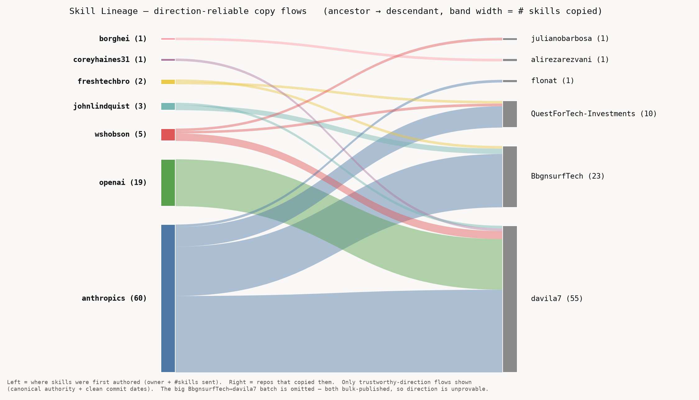

# Article Series — "Anatomy of the Agent Skills Ecosystem"

A five-part series (plus two bonuses) that turns the study + tooling into a
narrative. The arc funnels from macro to personal:

> **the ecosystem → the players → the standard → you**

Every article is backed by an artifact we've already built, so each ships with a
real figure, a dataset, and a reproducible command — not just opinion.

---

## 1. "4,900 Skills, 1,300 Ideas: How Skills Propagate"
**Thesis:** most of the ecosystem is copies. We can trace where each one came from.

- **Hook:** of 4,902 crawled skills, 598 are cross-repo duplicates in 260
  clusters — and the mega-collections are 100% single-commit bulk imports. The
  "ecosystem" is smaller than it looks.
- **The reveal:** first-commit-date ancestry → an origin story for each copied
  skill, including a **non-obvious ancestor** (a skill that started in a small
  repo and spread into a famous one).
- **Backed by:** `lineage.html` (Timeline + Sankey), `lineage_trace.py`,
  the bulk-publish table (`llm-judge-tuning.md`).
- **Figure:** the Sankey of repo→repo copy flows (`docs/figures/sankey-lineage.png`):

  

## 2. "Who's Actually Inventing? The Originators"
**Thesis:** the biggest repos aren't the inventors — the originators are smaller.

- **Hook:** rank repos by an **originator score** — how many skills they are the
  *ancestor* of (weighted by how far each spread), plus count of **novel
  concepts** they introduced that no one copied from elsewhere, plus
  **negative-space** coverage (skills in domains almost no one serves).
- **The reveal:** a leaderboard where mega-collections sink (they copy) and a few
  curated/individual repos rise (they originate).
- **Backed by:** lineage ancestry + the concept index in `audit_repo.py` +
  negative-space nodes already in the map.
- **Needs (small):** an `originator_leaderboard` rollup from `lineage.json` —
  the data exists; it's one script.

## 3. "Who's Doing the Best Work? A Quality Census"
**Thesis:** quality is concentrated, and popularity doesn't predict it.

- **Hook:** corpus median 79.8/100; quality dips in mega-collections (77% of
  all skills, median 78) vs curated repos at 85. Stars (r=0.16),
  recency (0.10), and commit count (−0.002) **all fail to predict quality**.
- **The reveal:** the repo *signature* predicts quality; nothing else does.
- **Backed by:** the signature study (`what-i-learned-crawling-39-repos.md`),
  `score_corpus.py`, the maturity null result.
- **Figure:** median quality by signature; quality-vs-stars scatter.

## 4. "What Makes a Skill 'Good'? The Gold Standard, Measured"
**Thesis:** "good" is measurable, and the cheapest fixes are the biggest.

- **Hook:** 68% of skills say *when* to use them but only **2.5%** say when
  *not* to — the anti-trigger note, the rarest practice in the ecosystem.
- **The reveal:** the rubric derived from `anthropics/skills`; quality is flat
  across skill types — the repo's discipline, not the task, sets quality.
- **Backed by:** `best-practices.md`, `skill-types.md`, `skill_quality.py`.

## 5. "Audit Your Skills in 60 Seconds (and Why You Should)"
**Thesis:** you can find your repo's signature, grade, and gaps with one command.

- **Hook:** run `audit_repo.py` on your repo (public or private) → signature,
  worst offenders, and the top general-purpose skills you're missing.
- **The reveal:** a worked example auditing a real repo live; the
  "if your repo looks like X, do Y" playbook.
- **Backed by:** `audit_repo.py`, `repo-signature-playbook.md`,
  `just-add-these-skills.md`.
- **CTA:** adopt `skill-creator` + a CI quality gate; add anti-triggers.

---

## Bonus A — "The LLM Judge That Called Anthropic 'Weak'"
A methodology piece for an AI-engineering audience: how an LLM grader goes
miscalibrated (truncation, missing context, no anchor) and how to fix it
(per-axis scoring, exemplars, feeding the file tree). Backed by
`llm-judge-tuning.md` and the v1→v2 recovery table. Strong standalone — it's a
transferable lesson about using LLMs as judges.

## Bonus B — "Negative Space: The Skills Nobody Has Built"
Built on the five negative-space domains already in the map. A forward-looking
"here's where the gaps are" piece — good as a series closer / call to action.

---

## Publishing notes
- **Order matters:** 1→5 is a funnel; each ends by teeing up the next. 3 and 4
  can swap if you want "the standard" before "the census."
- **Cadence:** weekly. Lead with #1 (the propagation/origin story) — it's the most
  novel and shareable, and the Sankey is the hero image.
- **Every post links back to the live map** and ends with the one-command audit.
- **Reusable spine:** each article = hook stat → figure → reveal → reproduce
  command → CTA to audit your own repo.

## What still needs building (small)
| Article | New artifact needed | Status |
|---|---|---|
| 2 (Originators) | `originator_leaderboard` from lineage.json | not yet — 1 script |
| 3 (Quality census) | quality-vs-stars scatter figure | data exists |
| all | hero figures exported as PNG/SVG | from lineage.html / map |
